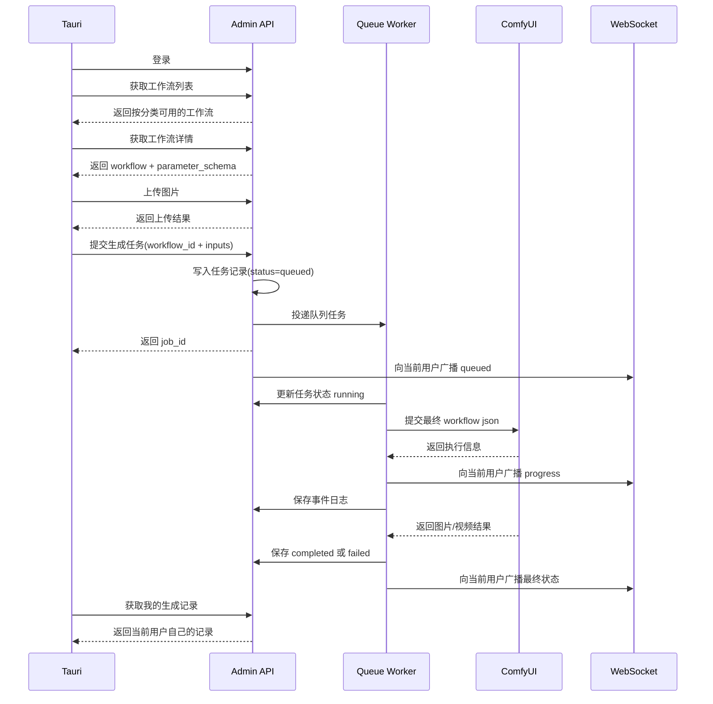

# Tauri + Admin 工作流任务实现文档

## 目标

这套方案要解决的不是“把 ComfyUI 接上去”这么简单，而是把桌面端发起任务、后端排队执行、实时回传进度、最终沉淀生成记录这整条链路打通。

系统分为三层：

- `Tauri 客户端`：登录员工使用，选择工作流、填写参数、上传图片、查看自己的生成结果。
- `Admin 后端`：统一提供认证、工作流接口、上传接口、任务创建、队列执行、生成日志、WebSocket 广播。
- `ComfyUI`：真正执行工作流，返回图片、视频等生成结果。

## 核心流程

### 0. 后端提供图片上传接口

后端需要先提供独立上传接口，给图生图、图生视频这类工作流使用。

建议接口：

- `POST /api/uploads/images`

请求：

- `multipart/form-data`
- 字段：`file`

响应：

```json
{
  "id": 1001,
  "url": "https://admin.example.com/storage/uploads/2026/04/xxx.png",
  "path": "uploads/2026/04/xxx.png",
  "filename": "xxx.png",
  "mime_type": "image/png",
  "size": 123456
}
```

要求：

- 只允许已登录员工上传。
- 校验文件类型、大小、后缀。
- 返回可用于后续任务表单的文件信息。
- 上传记录最好和用户关联，方便审计。

### 1. Tauri 获取工作流列表，并按分类分组展示

Tauri 启动并登录后，请求后端获取当前可用工作流列表。

建议接口：

- `GET /api/workflows`

返回示例：

```json
[
  {
    "id": 1,
    "name": "基础文生图",
    "category": "t2i",
    "category_label": "文生图",
    "description": "通用文生图工作流",
    "version": "v1",
    "is_active": true
  },
  {
    "id": 2,
    "name": "高清图生图",
    "category": "i2i",
    "category_label": "图生图",
    "description": "适合局部重绘与风格迁移",
    "version": "v2",
    "is_active": true
  }
]
```

Tauri 端处理规则：

- 拉取后仅展示 `is_active = true` 的工作流。
- 按 `category` 分组到现有页面中。
- 现阶段至少映射到：
  - `t2i` -> 文生图
  - `i2i` -> 图生图
  - `i2v` 或 `video` -> 图生视频
- 一个页面内允许出现多个工作流入口，不再写死成单一 JSON 工作流。

### 2. 点击工作流后拉取详情，并按 schema 动态渲染表单

用户点击某个工作流后，Tauri 再请求工作流详情，不能把所有细节都塞在列表接口里。

建议接口：

- `GET /api/workflows/{id}`

返回示例：

```json
{
  "id": 1,
  "name": "基础文生图",
  "category": "t2i",
  "description": "通用文生图工作流",
  "workflow_json": {
    "...": "ComfyUI workflow json"
  },
  "parameter_schema": {
    "prompt": {
      "type": "text",
      "label": "正向提示词",
      "required": true,
      "default": ""
    },
    "negative_prompt": {
      "type": "text",
      "label": "反向提示词",
      "required": false,
      "default": ""
    },
    "width": {
      "type": "number",
      "label": "宽度",
      "required": true,
      "default": 1024,
      "min": 256,
      "max": 2048,
      "step": 64
    },
    "height": {
      "type": "number",
      "label": "高度",
      "required": true,
      "default": 1024,
      "min": 256,
      "max": 2048,
      "step": 64
    },
    "source_image": {
      "type": "image",
      "label": "源图",
      "required": false
    }
  }
}
```

这里的“西格玛”建议统一理解为后端维护的 `parameter_schema`。它是 Tauri 动态表单的唯一依据。

Tauri 端实现要求：

- 根据 `parameter_schema` 动态生成表单。
- 支持常见字段类型：
  - `text`
  - `textarea`
  - `number`
  - `select`
  - `switch`
  - `image`
  - `file`
- `image` 类型字段先走上传接口，再把上传结果里的 `path/url/id` 填进任务参数。
- 表单校验以前端和后端双重校验为准，前端只做体验，后端做最终兜底。

### 3. 提交任务，发送工作流 ID + 表单参数，并等待 WebSocket 实时消息

用户填写完成后，Tauri 提交任务到后端。

建议接口：

- `POST /api/generation-jobs`

请求示例：

```json
{
  "workflow_id": 1,
  "inputs": {
    "prompt": "一个赛博朋克风格的猫",
    "negative_prompt": "模糊，低质量",
    "width": 1024,
    "height": 1024,
    "source_image": null
  },
  "client_request_id": "b0f5d6d1-0c88-4b17-8f95-0d2c98d6c123"
}
```

响应示例：

```json
{
  "job_id": 9001,
  "status": "queued"
}
```

提交成功后，Tauri 做两件事：

- 立刻把任务放进本地“处理中”列表。
- 订阅当前用户自己的 WebSocket 频道，等待任务状态变化。

WebSocket 事件建议包含：

- `queued`
- `running`
- `progress`
- `completed`
- `failed`

事件消息示例：

```json
{
  "job_id": 9001,
  "user_id": 12,
  "workflow_id": 1,
  "status": "progress",
  "progress": 45,
  "message": "ComfyUI 正在采样",
  "result": null,
  "error": null,
  "timestamp": "2026-04-09T10:00:00+08:00"
}
```

### 4. 后端接收任务并加入队列

后端收到 `generation-jobs` 请求后，不应该同步直连 ComfyUI。正确做法是先入库，再入队。

建议后端动作顺序：

1. 校验当前用户身份。
2. 校验工作流是否存在、是否启用。
3. 校验 `inputs` 是否符合 `parameter_schema`。
4. 创建任务记录，状态设为 `queued`。
5. 投递队列任务。
6. 返回 `job_id` 给 Tauri。
7. 立即广播一条 `queued` 事件给当前用户。

建议任务表字段：

- `id`
- `user_id`
- `workflow_id`
- `status`
- `inputs_json`
- `result_json`
- `error_message`
- `client_request_id`
- `queued_at`
- `started_at`
- `finished_at`

### 5. 队列执行任务，解析参数后动态拼接 workflow json 并调用 ComfyUI

队列消费者才是真正的执行器。

执行步骤建议如下：

1. 取出任务和关联工作流。
2. 将任务状态改为 `running`。
3. 把 `inputs_json` 注入工作流模板，生成最终的 ComfyUI workflow json。
4. 调用 ComfyUI prompt 接口提交任务。
5. 轮询或订阅 ComfyUI 结果。
6. 持续向当前用户广播实时状态。
7. 成功后写入图片、视频等结果。
8. 失败后记录错误信息。

关键点不是“能执行”，而是“消息不能串用户”。

WebSocket 隔离要求：

- 每个用户只订阅自己的私有频道。
- 事件里带 `job_id`，客户端按任务归并。
- 广播时必须基于 `user_id` 定向发送。
- 不允许使用全局公共频道推送所有任务状态。

建议频道模型：

- Laravel 频道名：`user.{userId}`
- Echo 订阅方式：`Echo.private(\`user.${userId}\`)`

这样 A 用户只能收到自己的任务状态，B 用户看不到 A 的任何生成过程和结果。

补充说明：

- Tauri 端建议使用 `laravel-echo` + `pusher-js` 对接 Reverb。
- 私有频道鉴权走 `/broadcasting/auth`。
- 鉴权请求必须带登录后的 Bearer Token。
- 详细配置见 [`docs/REVERB_TAURI_WEBSOCKET.md`](/Users/jran/Developer/codes/2026/beikuman_ai_tools/docs/REVERB_TAURI_WEBSOCKET.md)。

### 6. 成功失败都要保存生成日志

生成日志不是“成功才存”。失败也必须存，不然根本没法排查。

建议拆成两层：

#### 任务主表

记录一次生成任务的核心状态。

字段建议：

- `id`
- `user_id`
- `workflow_id`
- `status`
- `inputs_json`
- `result_json`
- `error_message`
- `started_at`
- `finished_at`

#### 任务事件表

记录状态流转和进度明细，方便排查和回放。

字段建议：

- `id`
- `generation_job_id`
- `status`
- `progress`
- `message`
- `payload_json`
- `created_at`

记录原则：

- `queued` 记一条
- `running` 记一条
- 每次重要 `progress` 记一条
- `completed` 记一条
- `failed` 记一条

成功结果建议写入：

- 图片 URL 列表
- 视频 URL 列表
- ComfyUI prompt id
- 消耗时长
- 使用模型

失败结果建议写入：

- 错误阶段
- 错误文案
- ComfyUI 原始返回
- 可复现的请求参数快照

### 7. 客户端查看自己的生成日志列表和结果

Tauri 端需要提供“我的生成记录”能力，至少能看见自己的图片、视频和失败记录。

建议接口：

- `GET /api/generation-jobs`
- `GET /api/generation-jobs/{id}`

列表页返回字段建议：

- `job_id`
- `workflow_name`
- `category`
- `status`
- `cover_url`
- `result_type`
- `created_at`

详情页返回字段建议：

- 基础任务信息
- 提交参数
- 进度事件列表
- 最终结果列表
- 失败错误信息

Tauri 端要求：

- 只能看到当前登录用户自己的记录。
- 列表支持按状态、分类、时间筛选。
- 图片结果支持预览和下载。
- 视频结果支持播放和下载。
- 失败任务能看到明确错误原因。

## 推荐接口清单

### 认证

- `POST /api/login`

### 上传

- `POST /api/uploads/images`

### 工作流

- `GET /api/workflows`
- `GET /api/workflows/{id}`

### 任务

- `POST /api/generation-jobs`
- `GET /api/generation-jobs`
- `GET /api/generation-jobs/{id}`

### WebSocket

- 用户私有频道：`private-user.{userId}`

## 数据流时序



## 模块职责划分

### Tauri 端

- 登录并持有用户身份
- 获取工作流列表
- 按分类展示工作流
- 动态渲染表单
- 上传图片
- 提交任务
- 订阅 WebSocket
- 展示实时状态
- 查看自己的生成记录

### Admin 后端

- 提供认证接口
- 提供上传接口
- 提供工作流列表和详情接口
- 提供任务创建与查询接口
- 校验参数合法性
- 写入任务和事件日志
- 投递与执行队列
- 广播用户私有实时消息

### ComfyUI

- 接收最终工作流 JSON
- 执行推理
- 返回进度和最终产物

## 必须守住的约束

- 任务必须和 `user_id` 强绑定。
- WebSocket 必须按用户隔离，不能串消息。
- 后端必须保存成功和失败日志。
- Tauri 表单必须来自后端 schema，不能继续把表单写死在前端。
- 图片上传必须先走后端，不要让客户端直接把文件路径塞进 ComfyUI。
- 任务执行必须异步队列化，不能阻塞接口请求。

## 建议的迭代顺序

### 第一阶段

- 登录
- 图片上传接口
- 工作流列表接口
- 工作流详情接口
- 动态表单
- 创建任务接口
- 任务入库并加入队列

### 第二阶段

- 队列执行 ComfyUI
- WebSocket 实时进度
- 用户私有频道隔离
- 成功失败日志完整记录

### 第三阶段

- 我的生成记录列表
- 任务详情页
- 图片预览与下载
- 视频播放与下载

## 一句话总结

这套实现的核心不是“桌面端调一下 ComfyUI”，而是把 `工作流定义 -> 动态表单 -> 上传素材 -> 创建任务 -> 队列执行 -> 用户私有实时消息 -> 结果与日志沉淀` 这条链打通，并且保证用户隔离、失败可追踪、结果可回看。
